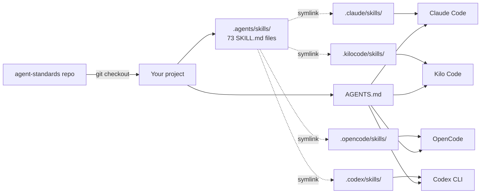

## Agent Standards


Drop-in template that ships an opinionated agent-coding setup (skills, openspec, MCP-ready scaffolds) into any project via git selective checkout.


---

### Who this is for

Teams onboarding AI coding agents who want one source of truth instead of per-project drift — same skills, same prompts, same MCP setup across every repo.

---

### Why

I use this across every project to keep AI coding standards consistent — same skills, same prompts, same MCP setup.

---

### Quickstart (TL;DR)

```bash
git config core.symlinks true
git remote add agent-standards https://github.com/Lukk17/agent-standards
git remote set-url --push agent-standards no_push
git fetch agent-standards
git checkout agent-standards/master -- .agents .claude .kilocode .opencode .codex AGENTS.md.example kilo.jsonc.example opencode.json.example
cp AGENTS.md.example AGENTS.md && git commit -am "Import agent-standards"
```

That's it — open the project in Claude Code, Kilo Code, OpenCode, or Codex and skills are live. Full walkthrough below.

---

### Architecture



One canonical `.agents/skills/` directory, four agents, zero duplication.

---

### What's in the box

- **`.agents/skills/`** — 73 canonical `SKILL.md` files (the source of truth, shared by every agent).
- **`.claude/`** — Claude Code bridge: `CLAUDE.md` that imports `AGENTS.md`, plus a `skills/` symlink.
- **`openspec/` scaffold** — spec-driven workflow (`openspec init` lands skills in `.agents/skills/` via the existing symlinks; commands go to each tool's native dir).
- **`AGENTS.md`** — shared instructions auto-read by Kilo Code, OpenCode, and Codex CLI; `AGENTS.md.example` is the template you copy into a new project.
- **MCP-ready scaffolds** — `.kilocode/`, `.opencode/`, `.codex/` directories with `skills/` symlinks pointing back to `.agents/skills/`, plus `kilo.jsonc.example` and `opencode.json.example` configs.

<details>
<summary><b>📚 Skills catalog (73 skills)</b></summary>

**Backend & languages**
`backend-patterns` · `python-patterns` · `python-testing` · `golang-patterns` · `golang-testing` · `java-coding-standards` · `springboot-patterns` · `springboot-security` · `springboot-tdd` · `springboot-verification` · `jpa-patterns` · `bash` · `powershell` · `embedded-c-arduino`

**Frontend & mobile**
`frontend-patterns` · `frontend-design` · `design-system` · `angular` · `nextjs-app-router-patterns` · `nextjs-best-practices` · `nextjs-turbopack` · `dart-flutter-patterns` · `flutter-architecture` · `flutter-layout` · `flutter-routing-and-navigation` · `flutter-forms` · `flutter-animation` · `flutter-accessibility` · `flutter-localization` · `flutter-caching` · `flutter-concurrency` · `flutter-databases` · `flutter-http-and-json` · `flutter-native-interop` · `flutter-platform-views` · `flutter-testing-apps` · `flutter-app-size` · `flutter-environment-setup-linux` · `flutter-environment-setup-macos` · `flutter-environment-setup-windows`

**Data & databases**
`postgres-patterns` · `mongodb-connection` · `mongodb-schema-design` · `mongodb-query-optimizer` · `mongodb-search-and-ai` · `database-migrations` · `pytorch-patterns`

**Architecture & APIs**
`api-design` · `hexagonal-architecture` · `architecture-decision-records` · `soap-webservices` · `keycloak-administration` · `keycloak-auth-services`

**Testing & quality**
`tdd-workflow` · `e2e-testing` · `ai-regression-testing` · `code-reviewer` · `review-duplication` · `coding-standards` · `security-review`

**DevOps & ops**
`docker-patterns` · `deployment-patterns` · `git-workflow` · `github-ops` · `ansible` · `jira-integration` · `automation-audit-ops` · `finance-billing-ops` · `agentic-engineering`

**Specialized domains**
`home-assistant` · `unity` · `kicad` · `g-code-3d-printing` · `seo`

</details>

---

### How to use

To import the central AI standards into this project without overwriting existing files, we use Git Selective Checkout.

This approach extracts only the required AI folders and template files directly into the project root.

To protect the central repository, we configure the remote as a read-only source in your local workspace by setting the push URL to an invalid address.

This ensures you can pull updates from the central repository, but Git will block any accidental pushes of your project-specific changes back to the global standards.

#### Step 1: Initial Setup

Enable symlink support in Git:
Globally
```shell
git config --global core.symlinks true
```
Locally for this repository only
```shell
git config core.symlinks true
```

Run these commands in the root of this project to add the remote, disable pushing, and extract the specific payload files into your workspace.

```bash
git remote add agent-standards https://github.com/Lukk17/agent-standards
```

```bash
git remote set-url --push agent-standards no_push
```

```bash
git fetch agent-standards
```

```bash
git checkout agent-standards/master -- .agents .claude .kilocode .opencode .codex AGENTS.md.example kilo.jsonc.example opencode.json.example
```

```bash
git commit -m "Import central agent-standards (.agents and .claude)"
```

#### Step 2: Pulling Future Updates

When the central standards repository is updated, pull the latest files into this project by running the following commands.

```bash
git fetch agent-standards
```

```bash
git checkout agent-standards/master -- .agents .claude
```

```bash
git commit -m "Update AI standards from central repository"
```

---

### Repository Structure

```
agent-standards/
  .agents/
    skills/                      # 71+ SKILL.md files (canonical source of truth)
  .claude/
    CLAUDE.md                    # @imports ../AGENTS.md (Claude Code bridge)
    skills -> ../.agents/skills/ # symlink for Claude Code compatibility
  .kilocode/
    skills -> ../.agents/skills/ # symlink for OpenSpec compatibility
  .opencode/
    skills -> ../.agents/skills/ # symlink for OpenSpec compatibility
  .codex/
    skills -> ../.agents/skills/ # symlink for OpenSpec compatibility
  AGENTS.md                      # Shared instructions (auto-read by Kilo, OpenCode, Codex)
  AGENTS.md.example              # Template for target project AGENTS.md
  kilo.jsonc.example             # Kilo Code config template
  opencode.json.example          # OpenCode config template (must stay at root)
```

---

### Agent Compatibility Matrix

#### Skills Discovery

| Agent | Native skill paths | Our solution |
|---|---|---|
| Claude Code | `.claude/skills/` | Symlink `.claude/skills/ → ../.agents/skills/` |
| Kilo Code | `.kilo/skills/`, `.agents/skills/`, `.claude/skills/` | Reads `.agents/skills/` natively |
| OpenCode | `.opencode/skills/`, `.agents/skills/`, `.claude/skills/` | Reads `.agents/skills/` natively |
| Codex CLI | `.agents/skills/` | Reads `.agents/skills/` natively |

#### Instructions Discovery

| Agent | Instruction file | How it loads |
|---|---|---|
| Claude Code | `CLAUDE.md` | `.claude/CLAUDE.md` imports `@../AGENTS.md` |
| Kilo Code | `AGENTS.md` | Auto-read from project root |
| OpenCode | `AGENTS.md` | Auto-read from project root (falls back to `CLAUDE.md`) |
| Codex CLI | `AGENTS.md` | Auto-read from project root (walks up from cwd) |

---

### Instruction Precedence (per agent)

#### Claude Code

```
1. Organization managed CLAUDE.md (/etc/claude-code/ or system dirs)
2. User-level: ~/.claude/CLAUDE.md
3. Ancestor CLAUDE.md files (walking up from cwd)
4. Project-level: ./CLAUDE.md or ./.claude/CLAUDE.md
5. Project-level: ./CLAUDE.local.md (personal, not versioned)
6. .claude/rules/*.md (path-scoped rules, auto-loaded)
7. @imported files (expanded inline, max 5 levels deep)
8. Skills (loaded on demand when invoked or matched)
```

#### Kilo Code

```
1. Global config: ~/.config/kilo/kilo.jsonc
2. Project root: kilo.jsonc
3. Project directory: .kilo/kilo.jsonc (takes priority over root kilo.jsonc)
4. AGENTS.md at project root (auto-read)
5. Skills from .kilo/skills/, .agents/skills/, .claude/skills/ (auto-discovered)
```

#### OpenCode

```
1. Remote config (.well-known/opencode) — organizational defaults
2. Global config (~/.config/opencode/opencode.json) — user preferences
3. Custom config (OPENCODE_CONFIG env var)
4. Project config (opencode.json at project root)
5. .opencode/ directories (agents/, commands/, plugins/, skills/)
6. Inline config (OPENCODE_CONFIG_CONTENT env var) — highest JSON override
7. Managed config files (system directories)
```

Note: `opencode.json` must be at the project root, not inside `.opencode/`. The `.opencode/` directory holds subdirectories (skills/, commands/, agents/).

#### Codex CLI

```
1. Global: ~/.codex/AGENTS.md (or AGENTS.override.md if exists)
2. Project root: AGENTS.md (or AGENTS.override.md if exists)
3. Subdirectories: AGENTS.md walking down from root to cwd
4. AGENTS.override.md at any level takes precedence over AGENTS.md at same level
5. Skills from .agents/skills/ (primary), walking up from cwd to repo root
```

Codex has no project-level config file. Global settings live in `~/.codex/config.toml`. Skills are scanned from `.agents/skills/` at every directory level up to the repo root.

---

### Activating the imported files

After Step 1, recreate the symlinks if your platform stripped them, then copy the example configs:

```bash
# Linux/macOS — run from project root (only if symlinks didn't survive the checkout)
mkdir -p .kilocode .opencode .codex
ln -s ../.agents/skills .kilocode/skills
ln -s ../.agents/skills .opencode/skills
ln -s ../.agents/skills .codex/skills

# Windows — run from project root (as Administrator or with Developer Mode enabled)
mkdir .kilocode .opencode .codex
mklink /D .kilocode\skills ..\.agents\skills
mklink /D .opencode\skills ..\.agents\skills
mklink /D .codex\skills ..\.agents\skills
```

```bash
cp AGENTS.md.example AGENTS.md
cp kilo.jsonc.example kilo.jsonc        # optional
cp opencode.json.example opencode.json  # optional
```

---

### Bootstrap prompt (first run)

Paste this into the agent on its very first run in a freshly-imported project. 
It forces the agent to verify the wiring works (instead of just claiming it does), discover the instruction tree, and patch any gaps before it writes a single line of code.


````text
You are bootstrapping into a project. 
Before you do any other work,
run this verification + wiring pass and report back as a checklist.

## 1. Verify skills wiring (read, don't list)

Skills live canonically in `.agents/skills/`. Every agent dir
(`.claude/skills/`, `.kilocode/skills/`, `.opencode/skills/`, `.codex/skills/`)
is a symlink pointing there. Symlinks frequently break on Windows checkouts —
do not trust a directory listing.

For your own agent's skills dir, open ONE skill through the symlink path
(e.g. `.claude/skills/coding-standards/SKILL.md`) and quote the first
heading line back. If the read fails, the symlink is broken — report it
and stop; do not silently fall back to `.agents/skills/`.

Then list which of the four agent dirs (`.claude`, `.kilocode`, `.opencode`,
`.codex`) actually exist in this repo, so missing setups surface.

## 2. Verify OpenSpec is callable

OpenSpec is a spec-driven workflow that MUST be used to plan any change
beyond a trivial single-file edit (typo, comment, one-liner). Verify it:

- Run `openspec --version` (or the equivalent agent-shell command) and
  report the version.
- Confirm an `openspec/` directory exists at the repo root with
  `specs/` and `changes/` subdirs.
- Confirm your agent's OpenSpec command is registered — name the slash
  command you would use to start a proposal in this shell.

If OpenSpec is missing or not callable, report it. Do not proceed to
implementation work without it for any non-trivial change.

## 3. Map the instruction tree

The root `AGENTS.md` is the canonical instruction file. More `AGENTS.md`
files MAY exist in submodules or subdirectories.

- Run `find . -name AGENTS.md -not -path './node_modules/*'` (or platform
  equivalent) and list every match.
- For Claude Code: open `.claude/CLAUDE.md` and list every `@`-imported
  path. Diff that list against the `find` output. Any `AGENTS.md` not
  imported is drift — flag it.

## 4. Fill the AGENTS.md stubs (core deliverable)

The `AGENTS.md.example` template ships with intentionally empty sections
that every project must fill. This is the WHOLE POINT of the bootstrap —
do not skip it and do not treat it as a side note.

Open the root `AGENTS.md` and look for empty sections or HTML-comment
placeholders (e.g. `<!-- Describe your project here -->`). At minimum:

- `## What This Repo Is` — one short paragraph: what the project does,
  who uses it, what stack. Derive from `package.json` / `pom.xml` /
  `pyproject.toml` / `Cargo.toml` / `go.mod` + the top-level file tree.
  Do not invent purpose; if the repo's purpose is unclear from evidence,
  say so and ask the user.
- `## Architecture` — bullet list: framework + version, key patterns
  in use (e.g. "App Router", "hexagonal", "BLoC"), deploy target,
  notable constraints (monorepo, SSR-only, offline-first, etc.).
  Derive from config files, folder structure, and any existing ADRs
  under `docs/` or `openspec/specs/`.

Filling these stubs is low-risk (editing an existing file the user
just imported and expects to fill). DO IT — write the drafted content
straight into root `AGENTS.md` as part of this bootstrap pass. Show
the diff in your report so the user can review and revise after.
Do NOT stop and ask for approval before this edit.

## 5. Decide if subdir AGENTS.md files are needed

Create an `AGENTS.md` in a subdir ONLY when that subdir has:

- its own toolchain or build system, OR
- its own deploy target / runtime, OR
- conventions that meaningfully differ from the root.

Single-app repos almost never need this. Three near-empty files are
worse than one good root file. If nothing qualifies, that is a ✅ —
not a warning.

## 6. Report — then wait

End your bootstrap with this checklist (✅ pass / ❌ broken — needs fixing).
"Considered and not needed" is ✅, not a warning. Use ❌ only for things
that are actually broken or missing wiring.

- [ ] Skills readable through my agent's symlink (quote the heading line)
- [ ] Agent dirs present: .claude / .kilocode / .opencode / .codex
- [ ] OpenSpec callable (version + slash command name)
- [ ] AGENTS.md inventory (paths found)
- [ ] CLAUDE.md @ imports match inventory (list any drift)
- [ ] Root AGENTS.md stubs filled (show the diff that was just applied)
- [ ] Subdir AGENTS.md needed? (yes + paths, or ✅ "no — single-app repo")
- [ ] CLAUDE.md @ imports needed? (yes + paths, or ✅ "no drift")

Auto-apply (no approval needed) — already done as part of this pass:
- Filling empty stub sections in root `AGENTS.md`.

Wait for approval before:
- Creating any NEW `AGENTS.md` files in subdirs.
- Adding NEW `@` imports to `.claude/CLAUDE.md`.

After approval, apply those changes and re-run the inventory diff to
confirm. If user pushes back on the stub fill, revise the root
`AGENTS.md` content based on their feedback.

## Operating rules from here on

- Any change beyond a trivial edit MUST start with an OpenSpec proposal.
- Skills are invoked via slash syntax (`/code-reviewer`, `/security-review`,
  `/coding-standards`, etc.) — use them instead of reinventing guidance.
- Treat `AGENTS.md` as the source of truth for project conventions.
````

---

### Working With AI Coding Agents

> Copy-paste-friendly section. Drop this into any target repo's README after importing `agent-standards` to document agent usage for your team.

This project follows shared standards imported from [agent-standards](https://github.com/Lukk17/agent-standards). All supported agents read `AGENTS.md` from the project root and discover skills from `.agents/skills/` automatically. Pick whichever agent you prefer — they all share the same instructions and skills.

#### Claude Code

Claude Code reads `.claude/CLAUDE.md`, which imports `AGENTS.md` via `@../AGENTS.md`. Skills in `.claude/skills/` (symlinked to `.agents/skills/`) are auto-discovered. No additional config required.

Start it from the project root:

```shell
claude
```

#### Kilo Code

Kilo Code reads `AGENTS.md` from the project root automatically and discovers skills from `.agents/skills/` natively.

Optionally copy `kilo.jsonc.example` to `kilo.jsonc` at the project root to enable additional instruction globs:

```jsonc
{
  "instructions": ["AGENTS.md"]
}
```

#### OpenCode

OpenCode reads `AGENTS.md` automatically and discovers skills from `.agents/skills/` natively.

Optionally copy `opencode.json.example` to `opencode.json` for additional configuration:

```json
{
  "$schema": "https://opencode.ai/config.json",
  "instructions": ["AGENTS.md"]
}
```

`opencode.json` must remain at the project root (not inside `.opencode/`).

#### Codex CLI

Codex reads `AGENTS.md` from the project root and discovers skills from `.agents/skills/` automatically. No project-level config file is required.

Start it from the project root:

```shell
codex
```

For global Codex settings, edit `~/.codex/config.toml`:

```toml
# Optional: increase instruction size limit (default: 32 KiB)
project_doc_max_bytes = 65536
```

#### Invoking skills

Skills are invoked from inside the agent shell using slash syntax. Examples:

```text
/code-reviewer
/security-review
/coding-standards
```

Depending on the agent UI, slash commands may appear as `/name` or `/name.md` in the autocomplete menu — use whichever your agent shows.

---

### OpenSpec Integration

[OpenSpec](https://github.com/Fission-AI/OpenSpec) is a spec-driven development framework that installs skills and commands into each agent's native directories.

#### How the symlinks work with OpenSpec

Make sure to enable symlinks in git:
```shell
git config core.symlinks true
```

The `.kilocode/skills/`, `.opencode/skills/`, and `.codex/skills/` directories are all symlinked to `.agents/skills/`. When `openspec init` writes skills to any of these directories, they land in `.agents/skills/` — the canonical location already read by all agents.

Commands are tool-specific (different formats per agent) and cannot be centralized. OpenSpec creates them in each tool's native commands directory, which is expected and correct.
#### Using OpenSpec in a project that imports agent-standards

After running Step 1 above, initialize OpenSpec in your project:

```bash
# Install OpenSpec globally
npm install -g @fission-ai/openspec@latest

# Initialize with all agents
# Skills land in .agents/skills/ via existing symlinks
# Commands are created in each tool's native commands directory
openspec init --tools "claude,kilocode,opencode,codex"
```

What `openspec init` creates:

```text
openspec/
  config.yaml              # OpenSpec project config
  specs/                   # Living documentation of your system
  changes/                 # Active feature work
    archive/               # Completed changes

# Skills (via symlinks, all land in .agents/skills/):
.agents/skills/openspec-workflow/SKILL.md
.agents/skills/openspec-specs/SKILL.md

# Commands (tool-specific, not symlinked):
.claude/commands/opsx/propose.md
.kilocode/workflows/opsx-propose.md
.opencode/commands/opsx-propose.md
```

Restart IDE and terminal after openspec initialization.

#### OpenSpec tool directories reference

| Tool | Skills written to | Commands written to |
|---|---|---|
| Claude Code | `.claude/skills/openspec-*/` -> `.agents/skills/` | `.claude/commands/opsx/*.md` |
| Kilo Code | `.kilocode/skills/openspec-*/` -> `.agents/skills/` | `.kilocode/workflows/opsx-*.md` |
| OpenCode | `.opencode/skills/openspec-*/` -> `.agents/skills/` | `.opencode/commands/opsx-*.md` |
| Codex | `.codex/skills/openspec-*/` -> `.agents/skills/` | `$CODEX_HOME/prompts/opsx-*.md` |

#### Command Syntax Variations

Because the AI coding landscape is fragmented, OpenSpec generates files for two different architectures. Depending on your specific agent UI, your commands will appear in one of two ways:
* Standalone Markdown Commands: Agents that read flat files will show commands with extensions in their dropdowns (e.g., /opsx-propose.md).
* Agent Skills: Agents that parse semantic SKILL.md metadata or have native integration will use standard slash syntax (e.g., /opsx:propose).

Use the syntax that appears in your agent's autocomplete menu.

#### The Full OpenSpec Workflow

Once initialized, invoke OpenSpec skills from your agent using the full artifact-driven lifecycle:

#### 0. Run Coding Agent
You need to start coding agent first - for example, by running in terminal:
```shell
claude
```
#### 1. Propose the change
Use multiline prompts to include logs or detailed context.
Inside coding agent shell run your specific command variation:

```text
/opsx:propose add dark mode support
```

```text
/opsx-propose.md add dark mode support
```
The agent creates the proposal, design, and implementation tasks under `openspec/changes/`.

#### 2. Apply the code
Review the generated `tasks.md` by manually editing md files or just telling agent what is wrong with it.

After plan approval agent can start implementation:

```text
/opsx:apply
```

```text
/opsx-apply.md
```
The agent writes the code and checks off the boxes in your `tasks.md`.

#### 3. Verify and refine
If bugs occur or tests fail, pass the logs back to refine the implementation.

```text
/opsx:verify The toggle button is invisible on mobile. Fix it.
```

```text
/opsx-verify.md The toggle button is invisible on mobile. Fix it.
```

#### 4. Archive the change
Once the code is working and tested, merge the documentation.

```text
/opsx:archive
```

```text
/opsx-archive.md
```
The agent merges the delta specs into `openspec/specs/` and moves the change folder to `openspec/changes/archive/`.
