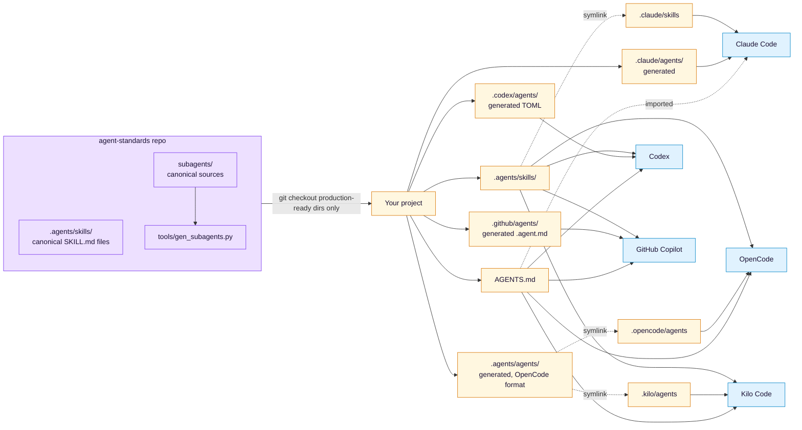

<div align="center">

# Agent Standards

One `git checkout` drops a shared AI coding setup (skills, subagents, MCP servers, OpenSpec scaffolding) into any
project.

[](https://github.com/Lukk17/agent-standards)
[](.agents/skills/)
[](subagents/)
[](docs/MCP_SETUP.md)
[](docs/AGENT_TOOLING.md#openspec-integration)
[](https://github.com/Lukk17/agent-standards/actions/workflows/ci.yml)
[](LICENSE)
[](docs/repository-layout.md)


</div>

---

### Why it exists

For developers and teams running multiple AI coding agents across multiple repos. Every project drifts (different
prompt files, skill versions, MCP configs, subagent definitions). This repo is the single source: import once, pull
updates with one `git fetch`. Used across every project in the portfolio.

Consumer projects pull only production-ready content: skills, generated subagent files, the preflight gate, the MCP
configs, and the shipped docs. The canonical [subagents/](subagents/) source and [tools/](tools/) generator stay here.

The canonical source is [.agents/skills/](.agents/skills/), which Codex, OpenCode, Kilo Code, and every GitHub Copilot
surface read natively. The layout follows the cross-tool AGENTS.md and SKILL.md conventions, so the setup stays
portable across the supported agents rather than tied to one tool.

---

### Quickstart

On Windows, turn on Developer Mode first, then this. Three paths in the import are symlinks and git will flatten them
into text files without it:

```bash
git config core.symlinks true
```

```bash
git remote add agent-standards https://github.com/Lukk17/agent-standards
```

```bash
git remote set-url --push agent-standards no_push
```

```bash
git fetch agent-standards
```

```bash
git checkout agent-standards/master -- .agents .claude .opencode .kilo .codex .github/agents .github/hooks .vscode/mcp.json .mcp.json opencode.json docs/AGENT_TOOLING.md docs/MCP_SETUP.md docs/AGENTS-UPDATE.md AGENTS.md.example
```

```bash
mv AGENTS.md.example AGENTS.md
```

That's it. Open the project in Claude Code, Kilo Code, OpenCode, Codex, or GitHub Copilot and skills are live.

The MCP config files arrive as real files, ready to use, so nothing else needs renaming:
[.mcp.json](.mcp.json) for Claude Code and the GitHub Copilot CLI, [opencode.json](opencode.json) for OpenCode and
Kilo Code, [.codex/config.toml](.codex/config.toml) for Codex, and [.vscode/mcp.json](.vscode/mcp.json) for Copilot in
VS Code. `AGENTS.md.example` is the only template left in the repo.

Human-side MCP setup (keys, environment variables, the two Copilot surfaces that get no file) lives in
[docs/MCP_SETUP.md](docs/MCP_SETUP.md).

Full walkthrough lives in [docs/AGENT_TOOLING.md](docs/AGENT_TOOLING.md).

---

### Per-agent setup

The Quickstart above is the recommended path and stays right for most projects: it pulls the whole setup once and
every agent then finds what it reads. If a project only ever sees one agent, the subsection for that agent pulls just
its share instead.

Run the first three Quickstart commands once so the read-only remote exists (`git remote add`,
`git remote set-url --push agent-standards no_push`, and `git fetch agent-standards`), then follow the single
subsection you need. Adding a second agent later is nothing more than running its subsection too, because the shared
paths are the same files.

#### Claude Code

Claude Code is the one agent here that reads neither `AGENTS.md` nor [.agents/skills/](.agents/skills/) on its own. It
gets the shared instructions from [.claude/CLAUDE.md](.claude/CLAUDE.md), which is a single `@../AGENTS.md` import,
the skills through the `.claude/skills` symlink, subagents from [.claude/agents/](.claude/agents/), hooks from
[.claude/settings.json](.claude/settings.json), and MCP servers from [.mcp.json](.mcp.json) at the project root.

`.claude/skills` is a symlink, so Windows needs Developer Mode on (Settings, System, For developers) and git told to
honour symlinks. Without both, git writes a text file holding the target path and Claude Code sees no skills at all.
PowerShell:

```powershell
git config core.symlinks true
```

The Unix shells need nothing here.

Pull what Claude Code reads. PowerShell:

```powershell
git checkout agent-standards/master -- .agents/skills .agents/hooks .claude .mcp.json AGENTS.md.example docs/AGENTS-UPDATE.md docs/MCP_SETUP.md
```

Unix shell:

```bash
git checkout agent-standards/master -- .agents/skills .agents/hooks .claude .mcp.json AGENTS.md.example docs/AGENTS-UPDATE.md docs/MCP_SETUP.md
```

Rename the template so the `@` import resolves. PowerShell:

```powershell
Rename-Item AGENTS.md.example AGENTS.md
```

Unix shell:

```bash
mv AGENTS.md.example AGENTS.md
```

To update later, fetch first. PowerShell:

```powershell
git fetch agent-standards
```

Unix shell:

```bash
git fetch agent-standards
```

Then pull upstream's half back over your tree. Your `AGENTS.md`, `.claude/CLAUDE.md`, `.claude/settings.json`, and
`.mcp.json` are left out on purpose, because they become yours at import. PowerShell:

```powershell
git checkout agent-standards/master -- .agents/skills .agents/hooks .claude/agents docs/AGENTS-UPDATE.md docs/MCP_SETUP.md
```

Unix shell:

```bash
git checkout agent-standards/master -- .agents/skills .agents/hooks .claude/agents docs/AGENTS-UPDATE.md docs/MCP_SETUP.md
```

#### Codex

Codex reads `AGENTS.md` and [.agents/skills/](.agents/skills/) natively, and it follows symlinks while scanning
them, so nothing has to be bridged. Custom agents come from [.codex/agents/](.codex/agents/) as TOML,
and [.codex/config.toml](.codex/config.toml) carries both the `[mcp_servers]` tables and the preflight hooks as inline
`[[hooks.*]]` tables. No symlink is involved in this set, so Windows needs neither Developer Mode nor
`git config core.symlinks true`.

Pull what Codex reads. PowerShell:

```powershell
git checkout agent-standards/master -- .agents/skills .agents/hooks .codex AGENTS.md.example docs/AGENTS-UPDATE.md docs/MCP_SETUP.md
```

Unix shell:

```bash
git checkout agent-standards/master -- .agents/skills .agents/hooks .codex AGENTS.md.example docs/AGENTS-UPDATE.md docs/MCP_SETUP.md
```

Rename the template. PowerShell:

```powershell
Rename-Item AGENTS.md.example AGENTS.md
```

Unix shell:

```bash
mv AGENTS.md.example AGENTS.md
```

Codex loads a project's `.codex/` layer only after you trust the project once, so approve it on first run or none of
the hooks and none of the MCP servers apply.

To update later, fetch first. PowerShell:

```powershell
git fetch agent-standards
```

Unix shell:

```bash
git fetch agent-standards
```

Then pull upstream's half back. `.codex/config.toml` stays out of it, because your MCP servers and the hook tables
share that one file, so merge an upstream change there by hand. PowerShell:

```powershell
git checkout agent-standards/master -- .agents/skills .agents/hooks .codex/agents docs/AGENTS-UPDATE.md docs/MCP_SETUP.md
```

Unix shell:

```bash
git checkout agent-standards/master -- .agents/skills .agents/hooks .codex/agents docs/AGENTS-UPDATE.md docs/MCP_SETUP.md
```

#### OpenCode

OpenCode reads `AGENTS.md` and [.agents/skills/](.agents/skills/) natively. Subagents arrive through the
`.opencode/agents` symlink into [.agents/agents/](.agents/agents/). [opencode.json](opencode.json) at the
project root declares the gate plugin by path in its `plugin` array and carries the MCP servers under its `mcp` key.
That file has to stay at the root, because inside `.opencode/` it is ignored.

`.opencode/agents` is a symlink, so Windows needs Developer Mode on (Settings, System, For developers) and git told to
honour symlinks, or OpenCode ends up with no subagents. PowerShell:

```powershell
git config core.symlinks true
```

The Unix shells need nothing here.

Pull what OpenCode reads. PowerShell:

```powershell
git checkout agent-standards/master -- .agents/skills .agents/agents .agents/hooks .agents/plugin .opencode opencode.json AGENTS.md.example docs/AGENTS-UPDATE.md docs/MCP_SETUP.md
```

Unix shell:

```bash
git checkout agent-standards/master -- .agents/skills .agents/agents .agents/hooks .agents/plugin .opencode opencode.json AGENTS.md.example docs/AGENTS-UPDATE.md docs/MCP_SETUP.md
```

Rename the template. PowerShell:

```powershell
Rename-Item AGENTS.md.example AGENTS.md
```

Unix shell:

```bash
mv AGENTS.md.example AGENTS.md
```

To update later, fetch first. PowerShell:

```powershell
git fetch agent-standards
```

Unix shell:

```bash
git fetch agent-standards
```

Then pull upstream's half back. `opencode.json` stays out, because it holds your MCP servers and the plugin
declaration together. PowerShell:

```powershell
git checkout agent-standards/master -- .agents/skills .agents/agents .agents/hooks .agents/plugin docs/AGENTS-UPDATE.md docs/MCP_SETUP.md
```

Unix shell:

```bash
git checkout agent-standards/master -- .agents/skills .agents/agents .agents/hooks .agents/plugin docs/AGENTS-UPDATE.md docs/MCP_SETUP.md
```

#### Kilo Code

Kilo Code works like OpenCode. It reads `AGENTS.md` and [.agents/skills/](.agents/skills/) natively, takes its
subagents through the `.kilo/agents` symlink into [.agents/agents/](.agents/agents/), and accepts
the root [opencode.json](opencode.json) as a project config file, so it picks up the gate plugin and the MCP block
from the same file OpenCode uses.

Kilo is stricter than OpenCode about substitution. A `{env:VAR}` anywhere in a project config file is a fatal error
for Kilo, and it rejects that entire file rather than leaving the token literal, which would cost it the MCP servers
and the gate plugin in one go. The shipped `opencode.json` therefore carries no tokens at all. Local servers still get
their secrets, because both tools start them with the environment of the process that started the agent, so exporting
the variable is enough. The single value that cannot be inherited is the Context7 API key, which travels in an HTTP
header, so `context7` ships unauthenticated on the free tier. Adding a paid key is a global-config change, described
in [docs/MCP_SETUP.md](docs/MCP_SETUP.md).

`.kilo/agents` is a symlink, so Windows needs Developer Mode on (Settings, System, For developers) and git told to
honour symlinks, or Kilo Code ends up with no subagents. PowerShell:

```powershell
git config core.symlinks true
```

The Unix shells need nothing here.

Pull what Kilo Code reads. PowerShell:

```powershell
git checkout agent-standards/master -- .agents/skills .agents/agents .agents/hooks .agents/plugin .kilo opencode.json AGENTS.md.example docs/AGENTS-UPDATE.md docs/MCP_SETUP.md
```

Unix shell:

```bash
git checkout agent-standards/master -- .agents/skills .agents/agents .agents/hooks .agents/plugin .kilo opencode.json AGENTS.md.example docs/AGENTS-UPDATE.md docs/MCP_SETUP.md
```

Rename the template. PowerShell:

```powershell
Rename-Item AGENTS.md.example AGENTS.md
```

Unix shell:

```bash
mv AGENTS.md.example AGENTS.md
```

To update later, fetch first. PowerShell:

```powershell
git fetch agent-standards
```

Unix shell:

```bash
git fetch agent-standards
```

Then pull upstream's half back, leaving `opencode.json` alone for the same reason as OpenCode. PowerShell:

```powershell
git checkout agent-standards/master -- .agents/skills .agents/agents .agents/hooks .agents/plugin docs/AGENTS-UPDATE.md docs/MCP_SETUP.md
```

Unix shell:

```bash
git checkout agent-standards/master -- .agents/skills .agents/agents .agents/hooks .agents/plugin docs/AGENTS-UPDATE.md docs/MCP_SETUP.md
```

#### GitHub Copilot

Copilot reads `AGENTS.md` and [.agents/skills/](.agents/skills/) natively on every surface: VS Code, the JetBrains
plugin, the CLI, and the cloud agent. No bridge file, and no symlink either, so Windows needs
neither Developer Mode nor `git config core.symlinks true`. Subagents have to be Copilot's own `*.agent.md` format in
[.github/agents/](.github/agents/), and the gate rides [.github/hooks/preflight.json](.github/hooks/preflight.json)
with camelCase event names. The JetBrains plugin reads `AGENTS.md` in agent mode too, per the March 2026 changelog,
even though GitHub's published support matrix still leaves JetBrains out of that column.

MCP is the part that splits per surface. The CLI reads the project [.mcp.json](.mcp.json), the same file Claude Code
uses, and it is the only Copilot surface that can. VS Code needs [.vscode/mcp.json](.vscode/mcp.json). The JetBrains
plugin reads a global path only and gets no project file at all, and the cloud agent takes JSON pasted into a
repository settings page. Both manual blocks live in [docs/MCP_SETUP.md](docs/MCP_SETUP.md).

Pull what Copilot reads. PowerShell:

```powershell
git checkout agent-standards/master -- .agents/skills .agents/hooks .github/agents .github/hooks .vscode/mcp.json .mcp.json AGENTS.md.example docs/AGENTS-UPDATE.md docs/MCP_SETUP.md
```

Unix shell:

```bash
git checkout agent-standards/master -- .agents/skills .agents/hooks .github/agents .github/hooks .vscode/mcp.json .mcp.json AGENTS.md.example docs/AGENTS-UPDATE.md docs/MCP_SETUP.md
```

Rename the template. PowerShell:

```powershell
Rename-Item AGENTS.md.example AGENTS.md
```

Unix shell:

```bash
mv AGENTS.md.example AGENTS.md
```

To update later, fetch first. PowerShell:

```powershell
git fetch agent-standards
```

Unix shell:

```bash
git fetch agent-standards
```

Then pull upstream's half back, leaving both MCP files alone because they are yours after the import. PowerShell:

```powershell
git checkout agent-standards/master -- .agents/skills .agents/hooks .github/agents .github/hooks docs/AGENTS-UPDATE.md docs/MCP_SETUP.md
```

Unix shell:

```bash
git checkout agent-standards/master -- .agents/skills .agents/hooks .github/agents .github/hooks docs/AGENTS-UPDATE.md docs/MCP_SETUP.md
```

#### Once you have customised the set

The update commands above pull every skill and subagent back, including ones you deleted on purpose. As soon as you
start adding or removing skills locally, switch to the selective refresh in
[docs/AGENTS-UPDATE.md](docs/AGENTS-UPDATE.md), which refreshes only what is already in your working tree.

---

### Architecture


```mermaid
graph LR
    subgraph AS[agent-standards repo]
      ASK[.agents/skills/<br/>canonical SKILL.md files]
      SU[subagents/<br/>canonical sources]
      GEN[tools/gen_subagents.py]
      SU --> GEN
    end
    AS -->|git checkout production-ready dirs only| P[Your project]
    P --> SK[.agents/skills/]
    P --> OA[.agents/agents/<br/>generated, OpenCode format]
    P --> CA[.claude/agents/<br/>generated]
    P --> CXA[.codex/agents/<br/>generated TOML]
    P --> GH[.github/agents/<br/>generated .agent.md]
    P --> AG[AGENTS.md]
    SK -.symlink.-> CL[.claude/skills]
    OA -.symlink.-> OCL[.opencode/agents]
    OA -.symlink.-> KIL[.kilo/agents]
    CL --> Claude[Claude Code]
    SK --> OpenCode[OpenCode]
    SK --> Kilo[Kilo Code]
    SK --> Codex[Codex]
    SK --> Copilot[GitHub Copilot]
    OCL --> OpenCode
    KIL --> Kilo
    CA --> Claude
    CXA --> Codex
    GH --> Copilot
    AG --> OpenCode
    AG --> Kilo
    AG --> Codex
    AG --> Copilot
    AG -.imported.-> Claude

    classDef src fill:#ede0ff,stroke:#7c3aed,color:#1a1033
    classDef consumer fill:#fff7e0,stroke:#d97706,color:#1a1033
    classDef tool fill:#e0f2fe,stroke:#0284c7,color:#1a1033
    class AS,ASK,SU,GEN src
    class P,SK,CA,OA,CXA,GH,AG,CL,OCL,KIL consumer
    class Claude,Kilo,OpenCode,Codex,Copilot tool
```

Two canonical sources in this repo: [.agents/skills/](.agents/skills/) and [subagents/](subagents/). Consumers receive
[.agents/skills/](.agents/skills/) plus four generated subagent trees ([.agents/agents/](.agents/agents/) in OpenCode
format, [.claude/agents/](.claude/agents/), [.codex/agents/](.codex/agents/) in TOML, and
[.github/agents/](.github/agents/) as `*.agent.md`). OpenCode and Kilo Code share the OpenCode-format tree through the
`.opencode/agents` and `.kilo/agents` symlinks rather than getting a copy each. The [subagents/](subagents/) source and
the [tools/](tools/) generator never ship downstream.

Full agent compatibility matrix (what each agent reads and where):
[docs/agent-compatibility.md](docs/agent-compatibility.md). Full repository layout and per-agent instruction
precedence: [docs/repository-layout.md](docs/repository-layout.md).

---

### Agent support

Four of the five agents read `AGENTS.md` and [.agents/skills/](.agents/skills/) natively. Claude Code reads neither,
so it gets an `@` import for the instructions and a symlink for the skills, both patterns its own documentation
supports. Subagents and MCP are per tool because no shared format exists. Full per-surface detail,
including what each hook surface can actually block, lives in
[docs/agent-compatibility.md](docs/agent-compatibility.md).

| Agent | Instructions | Skills | Subagents | Preflight | MCP config |
| --- | --- | --- | --- | --- | --- |
| Claude Code | `CLAUDE.md` imports `AGENTS.md` | `.claude/skills` (symlink) | `.claude/agents/` | hooks in `.claude/settings.json`, blocks tools and replies | `.mcp.json` |
| OpenCode | `AGENTS.md` (native) | `.agents/skills/` (native) | `.opencode/agents` (symlink) | shared plugin, blocks tools | `opencode.json` |
| Kilo Code | `AGENTS.md` (native) | `.agents/skills/` (native) | `.kilo/agents` (symlink) | the same plugin, blocks tools | `opencode.json` |
| Codex | `AGENTS.md` (native) | `.agents/skills/` (native) | `.codex/agents/` (TOML) | inline hooks in `.codex/config.toml`, blocks tools | `.codex/config.toml` |
| GitHub Copilot | `AGENTS.md` (native) | `.agents/skills/` (native) | `.github/agents/` (`*.agent.md`) | `.github/hooks/preflight.json`, blocks tools, no agent identity | `.vscode/mcp.json`, CLI uses `.mcp.json` |

---

### What's in the box

- [.agents/skills/](.agents/skills/): canonical `SKILL.md` files. Source of truth, shared by every agent, shipped
  to consumers. Browse the catalogue to see what's available.
- [.agents/hooks/](.agents/hooks/): `preflight_gate.py`, the one shared gate rule every agent surface wires into,
  and `no_ai_markers_check.py`, the formatting checker Claude Code runs on a `Stop` hook.
  [.agents/plugin/hooks.js](.agents/plugin/hooks.js): the OpenCode and Kilo Code adapter for that gate.
- [subagents/](subagents/) (this repo only): canonical subagent sources. Generator emits the per-tool copies.
- [tools/](tools/) (this repo only): the subagent generator, the markdown linter, and the pytest suite for the
  shared hook scripts in [tools/tests/](tools/tests/). The generator emits four subagent trees
  ([.agents/agents/](.agents/agents/), [.claude/agents/](.claude/agents/), [.codex/agents/](.codex/agents/),
  [.github/agents/](.github/agents/)) and maintains the `.opencode/agents` and `.kilo/agents` symlinks.
- [.claude/](.claude/): Claude Code bridge. [.claude/CLAUDE.md](.claude/CLAUDE.md) imports `AGENTS.md`, plus a
  `skills` symlink, a generated `agents/` tree, and the hooks in `settings.json`.
- OpenSpec scaffold (consumer side only, this repo ships no `openspec-*` skills of its own, because OpenSpec is a
  consumer concern): spec-driven workflow. Initialise it with the vendor-neutral `openspec init --tools agents`, which
  writes into `.agents/skills/` and creates no per-tool directories. That one target covers every agent, since Codex,
  OpenCode, Kilo Code, and Copilot read `.agents/skills/` natively and Claude Code reaches the same files through its
  `.claude/skills` symlink. Later, `openspec update` regenerates the per-agent files for the tools already configured
  in the project and takes no tools flag. Skip the per-tool targets: on top of fragmenting a layout built for one
  skills directory, OpenSpec 1.10.0 still hardcodes the abandoned `.kilocode` path for its Kilo target. See
  [docs/AGENT_TOOLING.md](docs/AGENT_TOOLING.md#openspec-integration).
- Companion OpenSpec schema (optional):
  [Lukk17/openspec-schemas](https://github.com/Lukk17/openspec-schemas) ships an `e2e-runbooks` schema for
  spec-driven end-to-end capability tests through OpenSpec's lifecycle. Install steps and the invocation live in
  [docs/AGENT_TOOLING.md](docs/AGENT_TOOLING.md#optional-a-custom-schema-for-end-to-end-capability-tests).
- AGENTS.md: shared instructions read natively by Codex, OpenCode, Kilo Code, and GitHub Copilot.
  [AGENTS.md.example](AGENTS.md.example) is the one template left, renamed to `AGENTS.md` on import.
- GitHub Copilot: [.github/agents/](.github/agents/) holds generated `*.agent.md` subagents, and
  [.github/hooks/preflight.json](.github/hooks/preflight.json) wires the gate through camelCase hook events. Copilot
  reads `AGENTS.md` and `.agents/skills/` natively on every surface, so no bridge instruction file ships. The
  JetBrains plugin reads `AGENTS.md` in agent mode too, per the March 2026 changelog, though GitHub's own support
  matrix still omits it.
- MCP config: [.mcp.json](.mcp.json) (Claude Code and the Copilot CLI), [opencode.json](opencode.json) (OpenCode
  and Kilo Code), [.codex/config.toml](.codex/config.toml) (Codex), and [.vscode/mcp.json](.vscode/mcp.json) (Copilot
  in VS Code). Four real files, one per agent surface, not templates.

Server list and configuration live in [docs/MCP_SETUP.md](docs/MCP_SETUP.md). Claude Code's file uses `${VAR}` with
defaults. The others hardcode their URLs because their substitution syntax has no fallback, and the shared OpenCode
and Kilo file carries no substitution tokens at all, because Kilo Code rejects a whole project config file that
contains one.

---

### How it compares

| Approach | What you get | Trade-off |
| --- | --- | --- |
| Copy-paste a single `AGENTS.md` | Fast start, one file | Drifts the moment upstream changes; no skills, no subagents, no MCP |
| Personal dotfiles repo | Total control | Manual sync, and not designed for cross-tool agent setup |
| Tool-native rules (Cursor rules, Claude Projects) | Works in that tool | Locks you in, no portability across the supported agents |
| Awesome lists / prompt collections | Inspiration | Curated reading, not an installable setup |
| agent-standards | One `git checkout` brings skills, subagents, MCP servers across every supported agent | Adds an `agent-standards` git remote; Windows symlinks need Developer Mode |

Where this loses: setup overhead (one-time), the remote dependency, and Windows symlink ergonomics.

Where it wins: a single source for the whole agent surface (skills, subagents, MCP, OpenSpec scaffolding), refreshed
with one `git fetch`.

---

### Working with subagents

The specialised subagents live as one canonical Markdown file each in [subagents/](subagents/) (this repo's root,
not shipped to consumer projects). A generator emits the four tool-specific trees that are shipped, and maintains
the two symlinks that let OpenCode and Kilo Code share one of them.

After editing any canonical file:

```bash
python tools/gen_subagents.py
```

CI gate (fails if generated tree is stale relative to canonical):

```bash
python tools/gen_subagents.py --check
```

Rules:

- Edit [subagents/<name>.md](subagents/) only. The generator overwrites all four trees:
  [.agents/agents/](.agents/agents/), [.claude/agents/](.claude/agents/), [.codex/agents/](.codex/agents/), and
  [.github/agents/](.github/agents/).
- Each tool gets its own format. Claude Code, Codex (TOML), and GitHub Copilot (`*.agent.md`) each need their own.
  OpenCode and Kilo Code take the same OpenCode-format markdown and both follow symlinks when scanning an agent
  directory, so they share [.agents/agents/](.agents/agents/) through `.opencode/agents` and `.kilo/agents`.
- Run the generator after any canonical change and commit both the source and the generated output. It also
  repairs the two symlinks if they went missing.
- Consumer projects pull only the generated trees. They never see [subagents/](subagents/) or [tools/](tools/).

Adding a new subagent: drop a frontmatter-headed Markdown file in [subagents/](subagents/) and re-run the generator.

Removing one: delete the canonical file and re-run. Orphaned outputs are pruned automatically.

---

### Pulling updates

Updates are driven from [docs/AGENTS-UPDATE.md](docs/AGENTS-UPDATE.md), a doc shipped from upstream that refreshes
itself on every run. It contains bash and PowerShell commands that:

- Refresh the shipped docs (`docs/AGENT_TOOLING.md`, `docs/MCP_SETUP.md`, and `docs/AGENTS-UPDATE.md` itself).
- Refresh the shared gate script and formatting checker in `.agents/hooks/`, the OpenCode and Kilo plugin in
  `.agents/plugin/`, and the Copilot hook file in `.github/hooks/`.
- Enumerate the skills already in the consumer's `.agents/skills/` and pull only those (no surprise additions).
- Enumerate the subagents already in the four generated trees (`.agents/agents/`, `.claude/agents/`, `.codex/agents/`,
  `.github/agents/`) and pull only those.

Files intentionally NOT touched by the update: the three symlinks (`.claude/skills`, `.opencode/agents`,
`.kilo/agents`, all of which follow their canonical directories anyway), `.claude/CLAUDE.md`, `AGENTS.md.example`, the
consumer's customised `AGENTS.md`, and the five configuration files (`.mcp.json`, `opencode.json`,
`.vscode/mcp.json`, `.codex/config.toml`, `.claude/settings.json`). Three of those five hold gate wiring next to
something of yours, so a checkout would take your MCP servers or your permissions with it.

When you do want an upstream change in one of the five, each shell section of that doc ends with a diff command and a
checkout for all five, and [what this skips](docs/AGENTS-UPDATE.md#what-this-skips-and-why) says which half of
each file is yours and which should track upstream.

If your project was imported before this doc shipped and has no `docs/AGENTS-UPDATE.md`, pull it with a one-off
`git checkout agent-standards/master -- docs/AGENTS-UPDATE.md`, then use it for every later refresh.

Full walkthrough lives in [docs/AGENT_TOOLING.md](docs/AGENT_TOOLING.md).

---

### Docs map

Naming convention: UPPERCASE filenames ship to consumer projects via the `git checkout` above, lowercase
filenames stay in this repo only.

#### Shipped to consumer projects

| File | What's in it |
| --- | --- |
| [docs/AGENT_TOOLING.md](docs/AGENT_TOOLING.md) | Initial import flow, future updates, subagents, MCP overview, full OpenSpec integration and workflow. |
| [docs/MCP_SETUP.md](docs/MCP_SETUP.md) | The real MCP config files, prerequisites, keys, env-var export per OS, the manual JetBrains and cloud-agent blocks, verification. |
| [docs/AGENTS-UPDATE.md](docs/AGENTS-UPDATE.md) | Per-shell selective update commands including the diff-first configuration-file pair, the Windows symlink prerequisite, and the OpenSpec init and update guidance. Refreshes itself. |

#### This repo only

| File | What's in it |
| --- | --- |
| [docs/global-setup.md](docs/global-setup.md) | Installing the same skills, subagents and gate into the user home so every project on the machine inherits them, per agent and per shell. Read it here, nothing is copied into a project. |
| [docs/agent-compatibility.md](docs/agent-compatibility.md) | Per-surface matrix of what each agent reads and what its hook surface can actually block. |
| [docs/repository-layout.md](docs/repository-layout.md) | Canonical versus generated versus symlink, the full tree, and instruction precedence per agent. |
| [docs/manual-setup.md](docs/manual-setup.md) | Fallback steps when the standard `git checkout` flow needs manual help (symlink recreation per OS) plus per-agent start commands. |
| [docs/bootstrap-prompt.md](docs/bootstrap-prompt.md) | First-run verification prompt to paste into the agent after import. Checks skills, subagents, symlinks, the gate, MCP, and OpenSpec. |
| [AGENTS.md](AGENTS.md) | How to work on the standards themselves: canonical versus generated trees, repo conventions, and the local verification commands. |
| [CONTRIBUTING.md](CONTRIBUTING.md) | Branching, commit style, the manual pipeline triggers, and the local checks a pull request has to pass. |
| [CHANGELOG.md](CHANGELOG.md) | Release history in Keep a Changelog form. |
| [sandbox-agent/README.md](sandbox-agent/README.md) | Containerised end-to-end sandbox. Installs all five agent CLIs, imports the standards into a throwaway project, and asserts each agent discovers them. |
| [e2e/README.md](e2e/README.md) | The capability test suites the sandbox runs, one spec per behaviour, plus how to run a single test or the whole sweep. |

#### Template

| File | What's in it |
| --- | --- |
| [AGENTS.md.example](AGENTS.md.example) | The one remaining template. Rename to `AGENTS.md` after import, then fill the project-specific sections. |

---

### Contributing

Issues and pull requests welcome. For non-trivial changes please open an issue first to discuss the approach. The repo
is opinionated by design and direction matters.

Maintained by [Łukasz Sarna](https://github.com/Lukk17).

---

### License

MIT, see [LICENSE](LICENSE).
