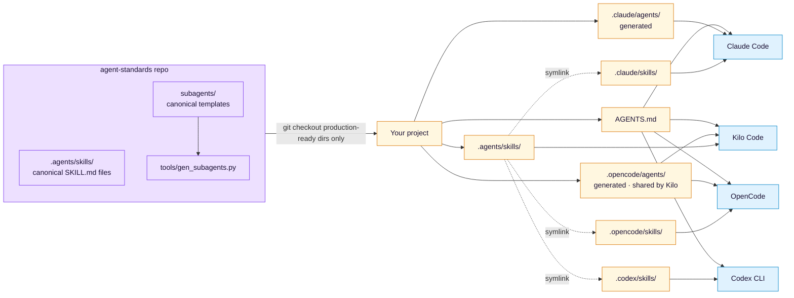

<div align="center">

# Agent Standards

**One `git checkout` drops a shared AI coding setup (skills, subagents, MCP servers, OpenSpec scaffolding) into any
project.**

[](https://github.com/Lukk17/agent-standards)
[](.agents/skills/)
[](subagents/)
[](docs/MCP_SETUP.md)
[](docs/AGENT_TOOLING.md#openspec-integration)
[](https://github.com/Lukk17/agent-standards/actions/workflows/ci.yml)
[](LICENSE)
[](docs/repository-layout.md)

</div>

---

### Quickstart

```bash
git config core.symlinks true
```

```bash
git remote add agent-standards https://github.com/Lukk17/agent-standards
```

```bash
git remote set-url --push agent-standards no_push
```

```bash
git fetch agent-standards
```

```bash
git checkout agent-standards/master -- .agents .claude .opencode .codex .kilocode docs/AGENT_TOOLING.md docs/MCP_SETUP.md docs/AGENTS-UPDATE.md AGENTS.md.example opencode.json.example .mcp.json.example
```

```bash
cp AGENTS.md.example AGENTS.md
```

That's it. Open the project in Claude Code, Kilo Code, OpenCode, or Codex and skills are live.

Optional next step: copy [.mcp.json.example](.mcp.json.example) to `.mcp.json` (Claude Code),
[opencode.json.example](opencode.json.example) to `opencode.json` (OpenCode), and
[.kilocode/mcp.json.example](.kilocode/mcp.json.example) to `.kilocode/mcp.json` (Kilo Code VS Code extension) to
enable the shared MCP server set.

Human-side MCP setup lives in [docs/MCP_SETUP.md](docs/MCP_SETUP.md).

Full walkthrough lives in [docs/AGENT_TOOLING.md](docs/AGENT_TOOLING.md).

---

### Why it exists

For developers and teams running multiple AI coding agents across multiple repos. Every project drifts (different
prompt files, skill versions, MCP configs, subagent definitions). This repo is the single source: import once, pull
updates with one `git fetch`. Used across every project in the portfolio.

Consumer projects pull only production-ready content: skills, generated subagent files, the tooling doc, and config
templates. The canonical [subagents/](subagents/) source and [tools/](tools/) generator stay here.

---

### Architecture


```mermaid
graph LR
    subgraph AS[agent-standards repo]
      ASK[.agents/skills/<br/>canonical SKILL.md files]
      SU[subagents/<br/>canonical templates]
      GEN[tools/gen_subagents.py]
      SU --> GEN
    end
    AS -->|git checkout production-ready dirs only| P[Your project]
    P --> SK[.agents/skills/]
    P --> CA[.claude/agents/<br/>generated]
    P --> OA[.opencode/agents/<br/>generated · shared by Kilo]
    P --> AG[AGENTS.md]
    SK -.symlink.-> CL[.claude/skills/]
    SK -.symlink.-> OC[.opencode/skills/]
    SK -.symlink.-> CX[.codex/skills/]
    CL --> Claude[Claude Code]
    SK --> Kilo[Kilo Code]
    OC --> OpenCode[OpenCode]
    CX --> Codex[Codex CLI]
    CA --> Claude
    OA --> Kilo
    OA --> OpenCode
    AG --> Claude
    AG --> Kilo
    AG --> OpenCode
    AG --> Codex

    classDef src fill:#ede0ff,stroke:#7c3aed,color:#1a1033
    classDef consumer fill:#fff7e0,stroke:#d97706,color:#1a1033
    classDef tool fill:#e0f2fe,stroke:#0284c7,color:#1a1033
    class AS,ASK,SU,GEN src
    class P,SK,CA,OA,AG,CL,OC,CX consumer
    class Claude,Kilo,OpenCode,Codex tool
```

Two canonical sources in this repo: [.agents/skills/](.agents/skills/) and [subagents/](subagents/). Consumer projects
receive only the production-ready dirs: [.agents/skills/](.agents/skills/), generated
[.claude/agents/](.claude/agents/), and generated [.opencode/agents/](.opencode/agents/) (which Kilo Code reads
natively, so no separate Kilo directory). The [subagents/](subagents/) source and the [tools/](tools/) generator never
ship to consumers.

Full repository layout, agent compatibility matrix, and per-agent instruction precedence:
[docs/repository-layout.md](docs/repository-layout.md).

---

### What's in the box

- **[.agents/skills/](.agents/skills/)**: canonical `SKILL.md` files. Source of truth, shared by every agent, shipped
  to consumers. Browse the catalogue to see what's available.
- **[subagents/](subagents/)** *(this repo only)*: canonical subagent templates. Generator emits per-tool copies.
- **[tools/](tools/)** *(this repo only)*: `gen_subagents.py` and `pyproject.toml`. Emits
  [.claude/agents/](.claude/agents/) and [.opencode/agents/](.opencode/agents/).
- **[.claude/](.claude/)**: Claude Code bridge. [.claude/CLAUDE.md](.claude/CLAUDE.md) imports
  [AGENTS.md](AGENTS.md.example), a `skills/` symlink, generated `agents/`.
- **OpenSpec scaffold**: spec-driven workflow. `openspec init` creates the `openspec/` directory in the consumer
  project; commands land in each tool's native dir.
  See [docs/AGENT_TOOLING.md](docs/AGENT_TOOLING.md#openspec-integration) for the full workflow.
- **Companion OpenSpec schema** *(optional)*:
  [Lukk17/openspec-schemas](https://github.com/Lukk17/openspec-schemas) ships an `e2e-runbooks` schema for
  spec-driven end-to-end capability tests through OpenSpec's lifecycle
  (`/opsx:new --schema e2e-runbooks`). Install steps live in
  [docs/AGENT_TOOLING.md](docs/AGENT_TOOLING.md#optional-install-a-custom-schema-for-e2e-capability-tests).
- **[AGENTS.md](AGENTS.md.example)**: shared instructions auto-read by Kilo, OpenCode, Codex.
  [AGENTS.md.example](AGENTS.md.example) is the template you copy into a new project.
- **MCP scaffolds**: [.mcp.json.example](.mcp.json.example), [opencode.json.example](opencode.json.example),
  [.kilocode/mcp.json.example](.kilocode/mcp.json.example), and [docs/MCP_SETUP.md](docs/MCP_SETUP.md) for the human
  setup.

Server list and configuration live in [docs/MCP_SETUP.md](docs/MCP_SETUP.md). All entries use `${VAR}` or `{env:VAR}`
substitution with defaults baked in.

---

### How it compares

| Approach | What you get | Trade-off |
| --- | --- | --- |
| Copy-paste a single `AGENTS.md` | Fast start, one file | Drifts the moment upstream changes; no skills, no subagents, no MCP |
| Personal dotfiles repo | Total control | Manual sync; not designed for cross-tool agent setup |
| Tool-native rules (Cursor rules, Claude Projects) | Works in that tool | Locks you in; no portability across the supported agents |
| Awesome lists / prompt collections | Inspiration | Curated reading, not an installable setup |
| **agent-standards** | One `git checkout` brings skills, subagents, MCP servers across every supported agent | Adds an `agent-standards` git remote; Windows symlinks need Developer Mode |

Where this loses: setup overhead (one-time), the remote dependency, and Windows symlink ergonomics.

Where it wins: a single source for the whole agent surface (skills, subagents, MCP, OpenSpec scaffolding), refreshed
with one `git fetch`.

---

### Working with subagents

The specialised subagents live as one canonical Markdown file each in [subagents/](subagents/) (this repo's root,
*not* shipped to consumer projects). A generator emits the two tool-specific copies that *are* shipped.

After editing any canonical file:

```bash
python tools/gen_subagents.py
```

CI gate (fails if generated tree is stale relative to canonical):

```bash
python tools/gen_subagents.py --check
```

Rules:

- **Edit [subagents/<name>.md](subagents/) only.** The generator overwrites [.claude/agents/](.claude/agents/) and
  [.opencode/agents/](.opencode/agents/).
- **Kilo Code reads [.opencode/agents/](.opencode/agents/) natively** per its current docs, so there is no separate
  Kilo directory.
- **Codex CLI has no per-agent file mechanism.** It sees [AGENTS.md](AGENTS.md.example) plus shared skills only.
- **Run the generator after any canonical change** and commit both the source and the generated output.
- **Consumer projects pull only the generated trees.** They never see [subagents/](subagents/) or [tools/](tools/).

Adding a new subagent: drop a frontmatter-headed Markdown file in [subagents/](subagents/) and re-run the generator.

Removing one: delete the canonical file and re-run. Orphaned outputs are pruned automatically.

---

### Pulling updates

Updates are driven from [docs/AGENTS-UPDATE.md](docs/AGENTS-UPDATE.md), a doc shipped from upstream that refreshes
itself on every run. It contains bash and PowerShell commands that:

- Refresh the shipped docs (`docs/AGENT_TOOLING.md`, `docs/MCP_SETUP.md`, and `docs/AGENTS-UPDATE.md` itself).
- Enumerate the skills already in the consumer's `.agents/skills/` and pull only those (no surprise additions).
- Enumerate the subagents already in `.claude/agents/` and `.opencode/agents/` and pull only those.

Files intentionally NOT touched by the update: the symlinked skill directories
(`.claude/skills/`, `.opencode/skills/`, `.codex/skills/`), `.claude/CLAUDE.md`, `AGENTS.md.example`, the
`.kilocode/*.example` templates, `opencode.json.example`, `.mcp.json.example`, and the consumer's customised
`AGENTS.md`.

If your project was imported before this doc shipped and has no `docs/AGENTS-UPDATE.md`, pull it with a one-off
`git checkout agent-standards/master -- docs/AGENTS-UPDATE.md`, then use it for every later refresh.

Full walkthrough lives in [docs/AGENT_TOOLING.md](docs/AGENT_TOOLING.md).

---

### Docs map

Naming convention: **UPPERCASE** filenames ship to consumer projects via the `git checkout` above; **lowercase**
filenames stay in this repo only.

**Shipped to consumer projects:**

| File | What's in it |
| --- | --- |
| [docs/AGENT_TOOLING.md](docs/AGENT_TOOLING.md) | Initial import flow, future updates, subagents, MCP overview, full OpenSpec integration and workflow. |
| [docs/MCP_SETUP.md](docs/MCP_SETUP.md) | Prerequisites, key acquisition, env-var export per OS, Claude Desktop and Codex CLI global configs, verification. |
| [docs/AGENTS-UPDATE.md](docs/AGENTS-UPDATE.md) | Per-OS selective update commands. Refreshes the shipped docs, plus the skills and subagents already present, and itself. |

**This repo only:**

| File | What's in it |
| --- | --- |
| [docs/repository-layout.md](docs/repository-layout.md) | Repo structure, agent compatibility matrix, instruction precedence per agent. |
| [docs/manual-setup.md](docs/manual-setup.md) | Fallback steps when the standard `git checkout` flow needs manual help (symlink recreation per OS) plus per-agent start commands. |
| [docs/bootstrap-prompt.md](docs/bootstrap-prompt.md) | First-run verification prompt to paste into the agent after import. Checks skills, subagents, MCP runtime, OpenSpec, instruction tree. |

**Template:**

| File | What's in it |
| --- | --- |
| [AGENTS.md.example](AGENTS.md.example) | Source instructions template. Copy to `AGENTS.md` after import; consumer projects fill the project-specific sections. |

---

### Contributing

Issues and pull requests welcome. For non-trivial changes please open an issue first to discuss the approach. The repo
is opinionated by design and direction matters.

Maintained by [Łukasz Sarna](https://github.com/Lukk17).

---

### License

MIT, see [LICENSE](LICENSE).
